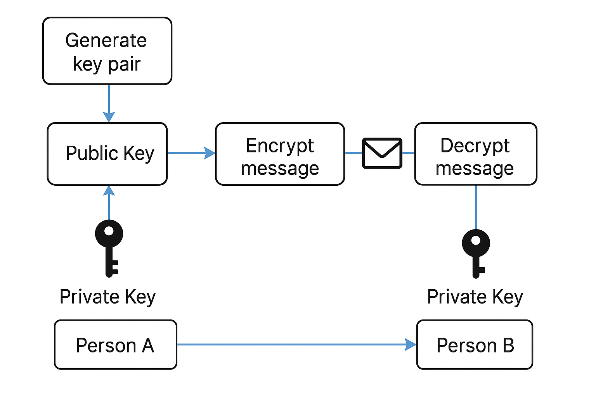

# Criptografia Assimétrica em Python

Este repositório contém um exemplo de criptografia assimétrica utilizando o módulo `cryptography` em Python. O processo simula uma comunicação segura entre duas pessoas (A e B), onde a pessoa A envia uma mensagem criptografada usando a chave pública de B, e B a descriptografa utilizando sua chave privada.

## Funcionamento do Código

1. **Geração das Chaves:**
   - O código gera um par de chaves usando o algoritmo RSA: uma chave pública e uma chave privada.
   - A chave pública é usada para criptografar a mensagem.
   - A chave privada é usada para descriptografar a mensagem.

2. **Criptografia da Mensagem:**
   - A pessoa A usa a chave pública de B para criptografar a mensagem.

3. **Descriptografia da Mensagem:**
   - A pessoa B usa sua chave privada para descriptografar a mensagem recebida.

### Diagrama de Fluxo

4. O diagrama a seguir ilustra o processo de comunicação criptografada entre as duas pessoas:



### Dependências

Certifique-se de ter as seguintes bibliotecas instaladas:

```bash
pip install cryptography
```

### Execução

Execute o arquivo em ambiente virtual python através da linha de comando abaixo:

```bash
python asymmetric_cryptography.py
```
